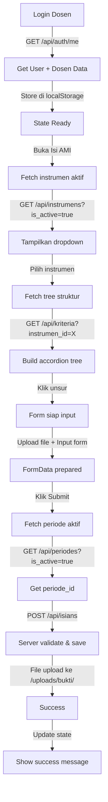

# API Integration & Data Synchronization Guide

## 📋 Checklist Integrasi API untuk Isi AMI

### ✅ Endpoint yang Diperlukan

#### 1. GET /api/periodes?is_active=true
**Status:** ✓ Sudah ada dan bekerja
```typescript
// Response
{
  data: [
    {
      id: "1",
      tahun: "2025/2026",
      is_active: true,
      tanggal_mulai: "2025-09-01",
      tanggal_selesai: "2026-06-30"
    }
  ]
}
```
**Digunakan di:** Fetch periode aktif saat submit isian

---

#### 2. GET /api/instrumens?is_active=true
**Status:** ✓ Sudah ada dan bekerja
```typescript
// Response
{
  data: [
    {
      id: "1",
      periode_id: "1",
      nama_instrumen: "Instrumen AMI Prodi 2025/2026",
      deskripsi: "...",
      is_active: true,
      created_by: "1"
    }
  ]
}
```
**Digunakan di:** Populate dropdown pilih instrumen

---

#### 3. GET /api/kriteria?instrumen_id={id}
**Status:** ✓ Sudah ada dan bekerja
```typescript
// Response dengan full tree structure
{
  data: [
    {
      id: "1",
      kode_kriteria: "K1",
      nama_kriteria: "Visi, Misi, Tujuan dan Strategi",
      deskripsi: "...",
      urutan: 1,
      kode_amis: [
        {
          id: "1",
          kode_ami: "A.1.1",
          urutan: 1,
          butir_standars: [...],
          deskripsi_areas: [
            {
              id: "1",
              deskripsi_area_audit: "Kejelasan visi, misi...",
              target_standar: "...",
              urutan: 1,
              pemeriksaan_unsurs: [
                {
                  id: "1",
                  isi_unsur: "Dokumen VMTS tersedia dan up-to-date",
                  urutan: 1
                },
                {
                  id: "2",
                  isi_unsur: "VMTS dirumuskan secara partisipatif",
                  urutan: 2
                }
              ]
            }
          ]
        }
      ]
    }
  ]
}
```
**Digunakan di:** Build accordion tree struktur instrumen

---

#### 4. POST /api/isians
**Status:** ✓ Sudah ada dan support file upload
```typescript
// Request (FormData)
{
  pemeriksaan_unsur_id: "1",
  periode_id: "1",
  judul_dokumen: "Dokumen VMTS",
  ketersediaan_standar: "ada",
  dokumen: "ada",
  pencapaian_standar_spt_pt: "true",
  pencapaian_standar_sn_dikti: "true",
  daya_saing_lokal: "true",
  daya_saing_nasional: "false",
  daya_saing_internasional: "false",
  bukti_link: "https://...",
  tahun_pelaksanaan: "2025",
  capaian: "Deskripsi capaian",
  keterangan: "Keterangan tambahan",
  bukti_file: File // Binary file
}

// Response
{
  status: 201,
  message: "Isian AMI berhasil disubmit",
  data: {
    id: "1",
    pemeriksaan_unsur_id: "1",
    periode_id: "1",
    dosen_id: "1",
    prodi_id: "1",
    status: "proses",
    bukti_files: [
      {
        id: "1",
        original_name: "dokumen.pdf",
        file_name: "bukti-1234567890-123456789.pdf",
        file_path: "/uploads/bukti/bukti-1234567890-123456789.pdf"
      }
    ]
  }
}
```
**Digunakan di:** Submit isian dengan file upload

---

#### 5. GET /api/isians
**Status:** ✓ Sudah ada, support filter per dosen
```typescript
// Query: GET /api/isians?periode_id=1&status=valid
// Dosen otomatis filtered berdasarkan JWT token

// Response
{
  data: [
    {
      id: "1",
      pemeriksaan_unsur: {
        isi_unsur: "Dokumen VMTS tersedia",
        deskripsi_area: {
          deskripsi_area_audit: "Kejelasan VMTS",
          kode_ami: {
            kode_ami: "A.1.1",
            kriteria: {
              kode_kriteria: "K1",
              nama_kriteria: "Visi, Misi, Tujuan",
              instrumen: {
                nama_instrumen: "Instrumen AMI 2025/2026"
              }
            }
          }
        }
      },
      periode: { tahun: "2025/2026" },
      judul_dokumen: "Dokumen VMTS",
      status: "valid",
      submitted_at: "2025-09-15",
      catatan_kaprodi: "Lengkap dan sesuai standar"
    }
  ]
}
```
**Digunakan di:** Fetch riwayat isian & revisi saya

---

## 🔍 Data Synchronization Flow



---

## ⚙️ Troubleshooting

### Issue 1: "FileText is not defined"
**Solusi:** ✓ FIXED
- Tambahkan import: `import { ..., FileText } from 'lucide-react'`
- Status: Updated di isi-ami/page.tsx

---

### Issue 2: Tree struktur kosong
**Kemungkinan penyebab:**
1. API /api/kriteria tidak return data → Check network tab
2. Structure tree tidak match dengan data → Check console
3. instrumen tidak punya kriteria → Verify seed data

**Debug:**
```javascript
// Di browser console
fetch('/api/kriteria?instrumen_id=1', {
  headers: { 'Authorization': `Bearer ${localStorage.getItem('ami_token')}` }
}).then(r => r.json()).then(d => console.log(JSON.stringify(d, null, 2)))
```

---

### Issue 3: Submit gagal / File tidak upload
**Kemungkinan penyebab:**
1. periode_id tidak ditemukan → Check apakah ada periode aktif
2. dosen_id tidak valid → Check JWT token
3. File terlalu besar → Max 10MB

**Debug:**
```javascript
// Check apakah ada periode aktif
fetch('/api/periodes?is_active=true', {
  headers: { 'Authorization': `Bearer ${localStorage.getItem('ami_token')}` }
}).then(r => r.json()).then(d => console.log(d.data))

// Check dosen profile
console.log(JSON.parse(localStorage.getItem('ami_user')))
```

---

### Issue 4: Data tidak sinkron antara Admin & Dosen
**Solusi:**
1. Refresh halaman sebelum input
2. Clear localStorage: `localStorage.clear()`
3. Re-login

---

## 📝 Testing Endpoints Manually

### Step 1: Get Auth Token
```bash
# Login as dosen
curl -X POST http://localhost:3000/api/auth/login \
  -H "Content-Type: application/json" \
  -d '{"email":"budi.santoso@polines.ac.id","password":"password123"}'

# Response: { token: "...", user: {...} }
# Copy token ke variable: TOKEN=your_token
```

### Step 2: Test Instrumen
```bash
curl -X GET "http://localhost:3000/api/instrumens?is_active=true" \
  -H "Authorization: Bearer $TOKEN"
```

### Step 3: Test Kriteria + Tree
```bash
# Replace {instrumen_id} dengan id dari step 2
curl -X GET "http://localhost:3000/api/kriteria?instrumen_id=1" \
  -H "Authorization: Bearer $TOKEN"
```

### Step 4: Test Periode Aktif
```bash
curl -X GET "http://localhost:3000/api/periodes?is_active=true" \
  -H "Authorization: Bearer $TOKEN"
```

### Step 5: Test Submit Isian (with file)
```bash
curl -X POST http://localhost:3000/api/isians \
  -H "Authorization: Bearer $TOKEN" \
  -F "pemeriksaan_unsur_id=1" \
  -F "periode_id=1" \
  -F "judul_dokumen=Test Dokumen" \
  -F "ketersediaan_standar=ada" \
  -F "dokumen=ada" \
  -F "pencapaian_standar_spt_pt=true" \
  -F "pencapaian_standar_sn_dikti=true" \
  -F "daya_saing_lokal=true" \
  -F "daya_saing_nasional=false" \
  -F "daya_saing_internasional=false" \
  -F "bukti_link=https://example.com" \
  -F "tahun_pelaksanaan=2025" \
  -F "capaian=Test capaian" \
  -F "keterangan=Test keterangan" \
  -F "bukti_file=@/path/to/file.pdf"
```

---

## 🔐 Security Checklist

- ✓ API guard untuk role (admin, dosen, kaprodi)
- ✓ Dosen hanya bisa access data miliknya (dosen_id comparison)
- ✓ Instrumen harus aktif untuk bisa diisi
- ✓ Isian dengan status valid tidak bisa diedit
- ✓ Token JWT disimpan di localStorage (pastikan secure flag saat production)

---

## 📊 Database Schema Verification

```sql
-- Check periode aktif
SELECT * FROM periodes WHERE is_active = TRUE;

-- Check instrumen
SELECT i.*, p.tahun FROM instrumens i
JOIN periodes p ON i.periode_id = p.id
WHERE i.is_active = TRUE;

-- Check struktur
SELECT k.*, COUNT(ka.id) as jumlah_ami
FROM kriteria_standars k
LEFT JOIN kode_amis ka ON k.id = ka.kriteria_id
WHERE k.instrumen_id = 1
GROUP BY k.id;

-- Check isian dosen
SELECT ia.*, d.nama_lengkap, iu.isi_unsur
FROM isian_ami ia
JOIN dosens d ON ia.dosen_id = d.id
JOIN pemeriksaan_unsurs iu ON ia.pemeriksaan_unsur_id = iu.id
WHERE ia.dosen_id = 1
ORDER BY ia.created_at DESC;
```

---

## 🚀 Next Steps

1. ✓ Test semua endpoints di browser console
2. ✓ Verify seed data sudah lengkap
3. ✓ Check Network tab untuk response times
4. ✓ Test upload dengan berbagai ukuran file
5. ⬜ Setup error logging untuk production
6. ⬜ Add API rate limiting
7. ⬜ Add data caching untuk performa
